<p align="center">
  
</p>

<p align="center">
  <strong>Cross-sectional alpha research on Binance USDT-margined perpetual futures.</strong><br />
  Economic hypotheses · disciplined backtesting · machine learning portfolios
</p>

<p align="center">
  
</p>

<p align="center">
  <a href="#research-question">Overview</a> ·
  <a href="#01-factor-construction--economic-logic">Factors</a> ·
  <a href="#02-backtest--single-factor-results">Backtest</a> ·
  <a href="#03-machine-learning-portfolios">Machine learning</a> ·
  <a href="#quick-start">Quick start</a> ·
  <a href="README.zh-CN.md">中文</a>
</p>

---

## Research question

**Can observable differences in trading activity, order flow and perpetual-market positioning help rank contracts by their next 24-hour returns?**

This project studies relative returns across contracts rather than the direction of the whole crypto market. A daily cross-sectional score becomes a long-short portfolio: buy the highest-ranked contracts, sell the lowest-ranked contracts, and account explicitly for funding and execution costs.

| Research universe | Signal horizon | Candidate library | Portfolio design |
| :--- | :--- | :--- | :--- |
| Binance USDT perpetuals | Next 24 hours | 91 research candidates | Top / bottom 20% target baskets |

The public release provides a research narrative and reusable portfolio-accounting components. Research datasets, proprietary factor implementations and model pipelines remain private. [Release scope →](docs/PUBLIC_SCOPE.md)

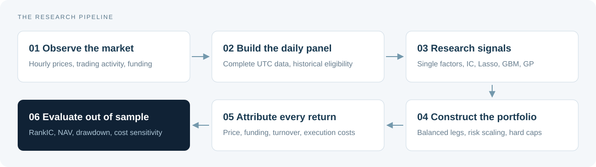

## 01. Factor construction & economic logic

### Why perpetual futures?

A continuously traded market exposes both conventional price-volume information and contract-specific positioning signals. Taker-buy volume describes aggressive buying activity; funding and perpetual-spot basis reflect the cost and intensity of leveraged demand. Intraday observations retain information that a daily close alone discards.

The research groups these observations into three themes:

| Theme | Observable information | Research hypothesis |
| :--- | :--- | :--- |
| **Trading pressure** | Taker activity, trade intensity, price-volume relationships | Persistent flows may carry information beyond contemporaneous price moves |
| **Positioning & crowding** | Funding and perpetual-spot basis | Expensive or crowded positioning may change subsequent relative returns |
| **Risk & market structure** | Volatility, liquidity, return tails, OHLC paths and UTC sessions | Compensation for risk and temporary price pressure may vary across contracts |

### The factor map

| Family | Economic interpretation | Main research question |
| :--- | :--- | :--- |
| Order flow / taker | Aggressive participation and persistence | Is buying pressure already reflected in prices? |
| Momentum / reversal | Continuation versus temporary dislocation | Does a recent move persist or unwind? |
| Funding / basis | Leveraged demand and positioning | Does crowding predict carry or reversal? |
| Volume / liquidity | Attention, depth and trading friction | Is apparent alpha compensation for poor liquidity? |
| Volatility | Total and idiosyncratic risk | How does risk relate to subsequent relative returns? |
| Market beta | Common crypto-market exposure | Is a signal distinct from market direction? |
| Higher moments / jumps | Asymmetry, extremes and discontinuities | Are tail events rewarded or overvalued? |
| Candlestick patterns | Intraday OHLC path | Does the path add information beyond the close? |
| Intraday sessions | Activity across UTC time blocks | Do flows differ systematically within a 24/7 market? |

### How the research develops each family

**Order flow.** Start with aggressive participation, then examine its persistence across observations, changes between intraday sessions, and divergence from price behavior. A flow that continues without an equivalent price response motivates an accumulation or absorption hypothesis. Related signals are compared for redundancy before combination.

**Funding and basis.** Treat them as positioning information as well as trading cash flows. Compare levels with recent changes and deviations from their own history; separate market-wide conditions from cross-sectional differences. Jointly elevated funding and basis motivate a crowding hypothesis, whose direction must be established in training.

**Momentum and reversal.** Compare short-lived price pressure with sustained trends. Consider whether recent reversal dominates a longer trend and whether the broad market regime changes the signal's behavior. Risk-adjusted and market-residual versions help distinguish directional moves from common risk exposure.

**Risk, liquidity and intraday paths.** Study activity through turnover, trade count and trade size; distinguish total volatility from market-residual risk; examine skewness, extreme hourly returns and jumps. OHLC paths and UTC-session activity provide additional descriptions of when and how the price move occurred. These are research directions; implementation formulas are not distributed.

### From correlated features to incremental signals

Closely related factors can repeatedly encode the same information. The research checks correlation and variance inflation, chooses an anchor, and uses cross-sectional residualization to isolate incremental components. Shrinkage provides another way to stabilize covariance estimates.

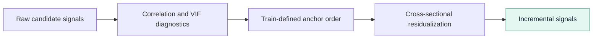

Direction, feature selection and transformation choices belong to the training process. Exact factor recipes and selected symbolic expressions are retained privately.

## 02. Backtest & single-factor results

### Data → signal → execution → accounting

The framework separates information available at signal formation from outcomes observed after trading. Eligibility comes from point-in-time inputs; missing future prices never improve the selected basket.

| Stage | Framework convention |
| :--- | :--- |
| Observe | Complete UTC daily windows of 24 hourly bars |
| Form signal | Features become available after the final input bar closes |
| Execute | Exact timestamp entry; default one-hour delay after signal availability |
| Hold | 24-hour entry-to-exit window |
| Allocate | Inverse-volatility long and short legs with a hard name cap |
| Scale risk | Past realized returns only; maintain equal dollar exposure on both legs |
| Rebalance | New target compared with the drifted live portfolio |
| Attribute | Price PnL, funding, commission, half-spread, slippage and impact |

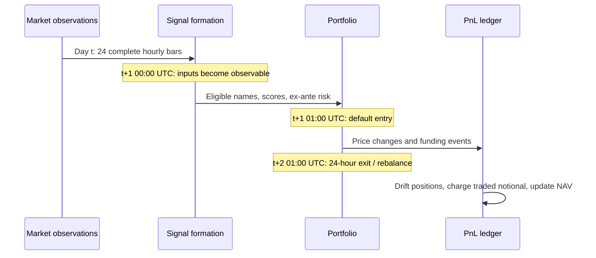

For a signed portfolio weight, positive funding is a cost to the long position and a receipt to the short position:

```text
Net portfolio return = price contribution + funding contribution - execution costs
Funding contribution = -sum(weight × funding payment per entry notional)
```

The package includes completeness checks, funding coverage checks, strict missing-outcome handling and a bankruptcy guard. It is a daily accounting engine; exchange-order and intraday margin simulation sit outside its scope. [Framework details →](docs/FRAMEWORK.md)

### Single-factor research snapshot

The presentation evaluates individual signals through a common long-short process. The following are selected presentation summaries under **2 bps transaction costs**, with the evaluation window **January 2024–February 2026**.

| Signal | CAGR | Sharpe | Maximum drawdown | Average daily turnover |
| :--- | ---: | ---: | ---: | ---: |
| Intraday return skewness | 25.4% | 1.45 | −11.1% | 1.57 |
| 3-day reversal | 11.8% | 0.76 | −14.4% | 0.36 |
| Mid-session return | 16.1% | 0.74 | −22.0% | 1.60 |
| Upper-shadow ratio | 8.3% | 0.56 | −28.3% | 1.55 |
| 24-hour reversal | 3.0% | 0.24 | −27.1% | 1.59 |
| Taker-imbalance volatility | 3.1% | 0.26 | −22.8% | 0.95 |
| Perpetual-spot basis | 1.0% | 0.14 | −15.7% | 1.36 |
| Amihud price impact | 0.3% | 0.12 | −25.5% | 0.79 |

*Source: research presentation, single-factor section. Turnover is traded gross notional relative to portfolio equity. The source data and daily return series are retained privately.*

#### Visual evidence: intraday skewness and short-horizon reversal

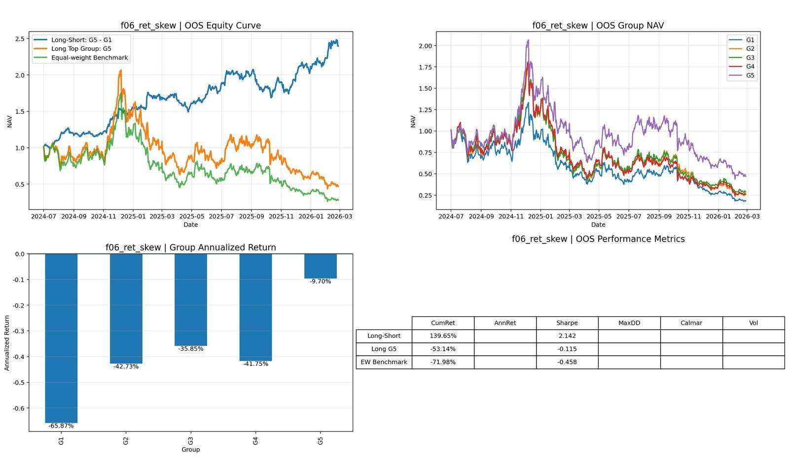

*Intraday return skewness. The presentation graphic combines portfolio paths, group returns and a performance summary.*

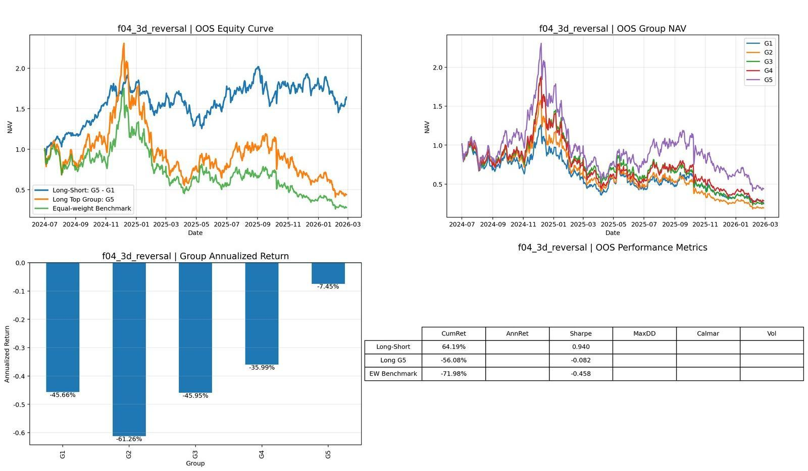

*Three-day reversal. A lower-turnover comparison to the intraday signal above.*

<details>
<summary><strong>Explore six additional single-factor charts</strong></summary>

#### 24-hour reversal

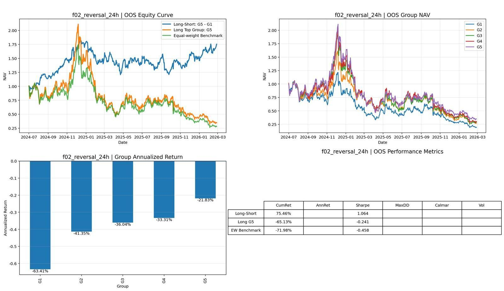

#### Mid-session return

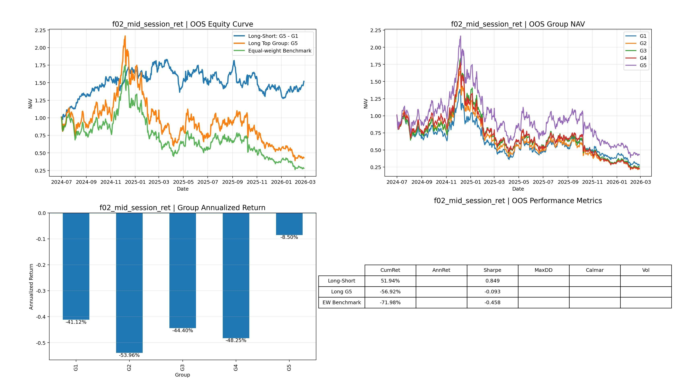

#### Upper-shadow ratio

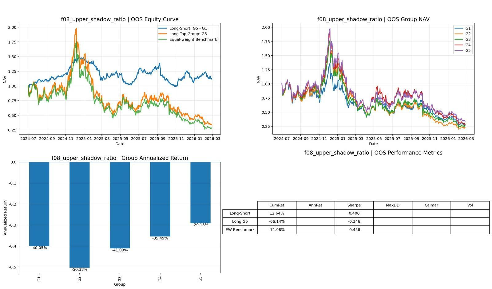

#### Taker-imbalance volatility

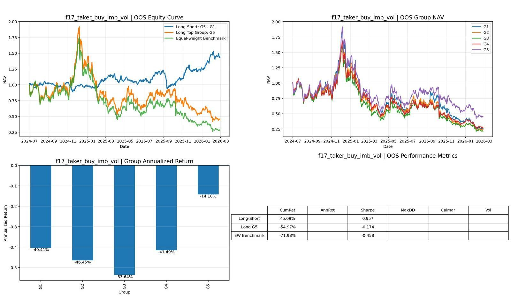

#### Perpetual-spot basis

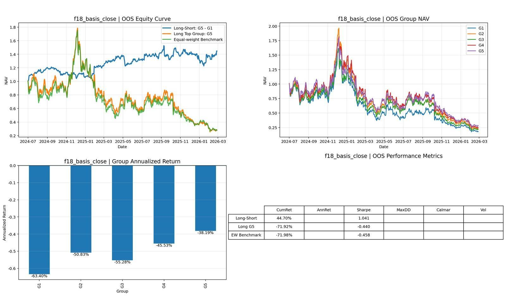

#### Amihud price impact

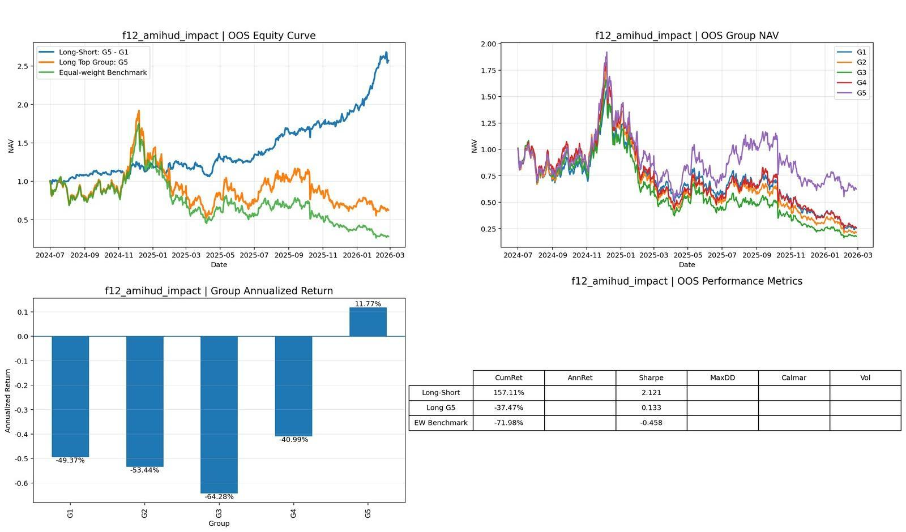

</details>

The research compares ranking quality, portfolio risk and trading intensity together. A high-turnover signal needs a stronger edge to survive costs; a promising economic hypothesis does not necessarily produce a strong portfolio result.

## 03. Machine learning portfolios

### A shared experiment design

The modeling layer combines a cross-sectional factor panel into one score per contract. The presentation uses **2020–2023 for training** and **January 2024–February 2026 for evaluation**, with rolling training and cross-sectional preprocessing. Each model's score passes through the same portfolio construction and accounting process.

| Method | Mapping | Why include it? | Main constraint |
| :--- | :--- | :--- | :--- |
| **Rolling IC weighting** | Recent matured RankIC → feature weights | Transparent, interpretable baseline | Sensitive to IC stability |
| **Lasso** | Sparse linear prediction | Feature selection and regularization | Restricted to linear combinations |
| **LightGBM / GBM** | Nonlinear tree ensemble | Interactions and conditional relationships | Greater complexity and overfitting risk |

### Composite comparison

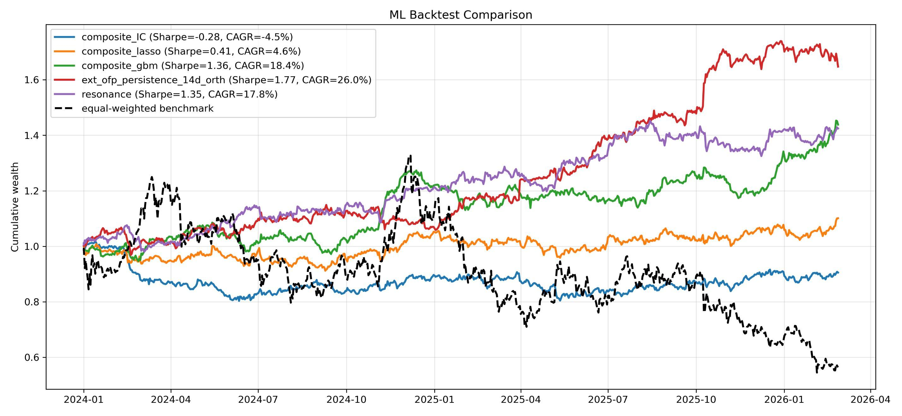

*Common evaluation window, with the equal-weighted benchmark shown alongside the research portfolios.*

| Presentation model | CAGR | Sharpe |
| :--- | ---: | ---: |
| Rolling IC composite | −4.5% | −0.28 |
| Lasso composite | 4.6% | 0.41 |
| GBM composite | 18.4% | 1.36 |
| Orthogonal order-flow reference | 26.0% | 1.77 |
| Reference composite | 17.8% | 1.35 |

*Source: presentation, “ML Portfolio – Combine.” The table preserves the comparison's reported figures, including weaker baselines.*

### Genetic programming: discover, select, evaluate

Symbolic search extends the feature space through combinations of arithmetic, ranking and nonlinear operators. Candidate expressions are optimized on training-period RankIC or long-short Sharpe, filtered for redundancy, and passed to an independent evaluation stage. The presentation retains the top five candidates after correlation filtering.

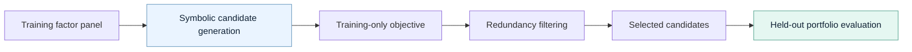

The presentation's selected symbolic candidate reports **40.4% CAGR and 2.59 Sharpe**. The expression, search implementation and selected research artifacts are retained privately. The public framework can evaluate externally supplied scores from any of these methods.

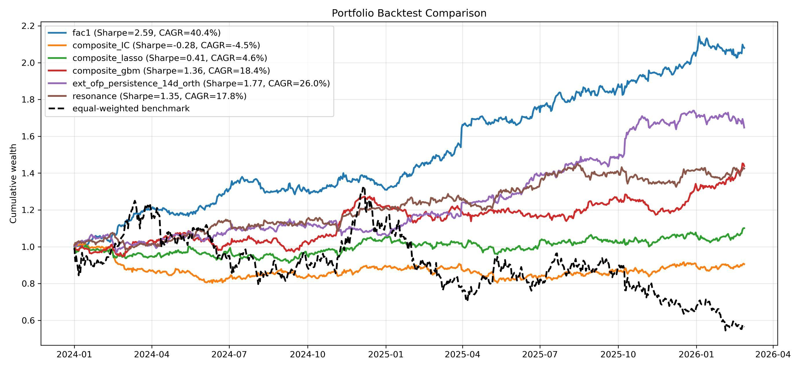

*The presentation labels the selected symbolic candidate “fac1.” Its formula is excluded from the public release.*

## Quick start

Python 3.10 or later is required. The public accounting package depends only on NumPy and pandas.

```bash
git clone https://github.com/SmartR168/Predict-crypto-returns-in-the-cross-section-public.git
cd Predict-crypto-returns-in-the-cross-section-public
python -m pip install -e .
python examples/synthetic_demo.py
python -m unittest discover -s tests -v
```

The example generates random scores, prices and funding inputs in memory. Its output demonstrates portfolio accounting and is separate from the research performance above.

<details>
<summary><strong>Use your own point-in-time panel</strong></summary>

```python
from crypto_cs import BacktestConfig, performance_stats, run_cross_sectional_backtest

# panel: one row per UTC signal date and contract; see the input contract.
daily, positions = run_cross_sectional_backtest(
    panel,
    BacktestConfig(target_annual_vol=None),
)
stats = performance_stats(daily)
```

Selection inputs: `date`, `symbol`, `signal`, `tradable_at_signal`, `ex_ante_vol`.
Accounting inputs: `fwd_price_return`, `fwd_funding_rate`.

[Full input contract →](docs/DATA_CONTRACT.md)

</details>

## Repository guide

```text
src/crypto_cs/       Time alignment, funding and portfolio accounting
examples/           Generated demonstration; no research dataset
tests/              Accounting and timing regression tests
docs/               Framework, input contract and public release scope
assets/             README artwork and selected presentation graphics
```

| Read next | Purpose |
| :--- | :--- |
| [Framework](docs/FRAMEWORK.md) | Trading clock, constraints, attribution and assumptions |
| [Input contract](docs/DATA_CONTRACT.md) | Connect your own data without private infrastructure |
| [Public scope](docs/PUBLIC_SCOPE.md) | Understand which research components are distributed |
| [中文概览](README.zh-CN.md) | Chinese research narrative and usage guide |

## Research context

The project sits at the intersection of cross-sectional asset pricing, market microstructure and statistical learning. Relevant background includes [Liu, Tsyvinski & Wu, *Common Risk Factors in Cryptocurrency*](https://doi.org/10.1111/jofi.13119). Methodological presentation was informed by the clear documentation structures of [Qlib](https://github.com/microsoft/qlib) and [vectorbt](https://github.com/polakowo/vectorbt).

---

<p align="center"><strong>RONG Jia</strong><br />Predict crypto returns in the cross-section<br /><sub>Research overview · Selected public framework</sub></p>
